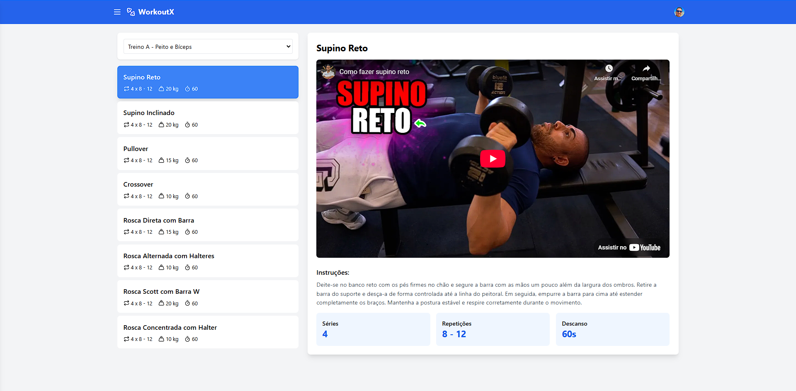

# WorkoutX


**WorkoutX** é um aplicativo web desenvolvido em React para auxiliar você a organizar, planejar e acompanhar seus treinos de forma eficiente. Gerencie seus exercícios, defina suas séries, repetições, cargas e tempos de descanso, além de ter acesso a vídeos e instruções detalhadas para a execução correta de cada movimento.

## Demonstração

Experimente o WorkoutX agora mesmo: [https://workoutx.site](https://workoutx.site)

## Screenshots



## Tecnologias Utilizadas

*   **Front-end:**
    *   [React](https://react.dev/): Biblioteca JavaScript para construção de interfaces de usuário.
    *   [Tailwind CSS](https://tailwindcss.com/): Framework CSS utilitário para estilização rápida e consistente.
    *   [Context API](https://react.dev/learn/passing-data-deeply-with-context): Gerenciamento de estado global da aplicação.
    *   [React Router](https://reactrouter.com/): Biblioteca para navegação entre as páginas.
    *   [Clerk Auth](https://clerk.com/): Autenticação de usuários.
    *   [Axios](https://axios-http.com/): Cliente HTTP para realizar requisições à API.
    *   [React Toastify](https://react-toastify.js.org/): Biblioteca para exibição de notificações.
    *   [Lucide React](https://lucide.dev/icons): Biblioteca de ícones.
    *   [Chart.js](https://www.chartjs.org/): Biblioteca para criação de gráficos.
*   **Back-end:**
    *   Node.js
    *   Fastify
    *   Prisma
*   **Banco de Dados:**
    *   PostgreSQL

## Funcionalidades

*   **Cadastro e gerenciamento de treinos:** Crie e personalize seus treinos de forma simples e intuitiva.
*   **Organização detalhada dos exercícios:** Defina séries, repetições, pesos e tempos de descanso para cada exercício.
*   **Vídeos e instruções:** Acesse vídeos e descrições detalhadas para garantir a execução correta dos exercícios.
*   **Interface intuitiva e responsiva:** Utilize o aplicativo em qualquer dispositivo, com uma experiência de usuário otimizada.
*   **Sincronização na nuvem:** Acesse seus treinos de qualquer lugar, com sincronização automática na nuvem.
*   **Geração de treinos com IA:** Crie treinos personalizados com o auxílio da inteligência artificial.
*   **Comunidade:** Compartilhe seus treinos com outros usuários e inspire-se com os treinos da comunidade.
*   **Dashboard:** Acompanhe seu progresso com gráficos e estatísticas.

## Melhorias

*   [x] Cadastro de treinos
*   [x] Detalhes do treino
*   [x] Listagem de treinos
*   [x] Perfil de usuário
*   [x] Geração de treinos com IA
*   [x] Exclusão de exercícios
*   [x] Compartilhamento de treinos
*   [x] Cópia de treinos de outros usuários através da comunidade
*   [x] Comunidade
*   [x] Dashboard com métricas dos treinos
*   [ ] Notificações e lembretes

## Variáveis de Ambiente

Crie um arquivo `.env` na raiz do projeto com as seguintes variáveis:

```env
VITE_API_BASE_URL=http://localhost:3000
VITE_CLERK_PUBLISHABLE_KEY=pk_test_Y29uY3JldGUtc2hhcmstNTQuY2xlcmsuYWNjb3VudHMuZGV2JA
VITE_DNS_SENTRY=
```

Adapte os valores conforme necessário para seu ambiente.
## Suporte

Encontrou algum problema ou tem alguma sugestão? Envie um e-mail para shinodalabs@gmail.com.

## Autores

*   [Rodrigo Shinoda](https://www.github.com/rodrigordgfs)

## Feedback

Sua opinião é muito importante para nós! Compartilhe suas sugestões e ideias através de shinodalabs@gmail.com.
