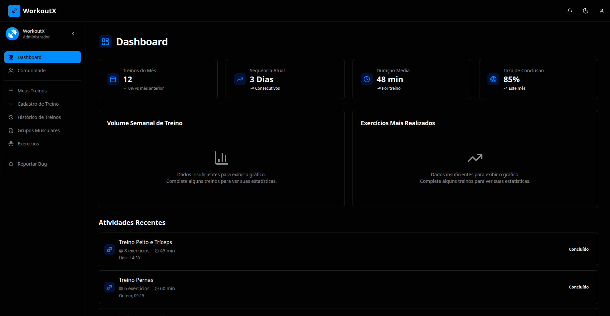

# 🏋️ WorkoutX - Aplicativo de Treinos de Musculação



WorkoutX é uma aplicação web moderna e completa para gerenciamento de treinos de musculação, desenvolvida com Next.js 15, TypeScript e integração com Clerk para autenticação.

## ✨ Funcionalidades

### 🎯 Gestão de Treinos
- **Criar Treinos Personalizados**: Crie treinos personalizados com exercícios específicos
- **Histórico de Treinos**: Acompanhe seu progresso ao longo do tempo
- **Execução de Treinos**: Interface intuitiva para executar treinos em tempo real
- **Controle de Séries e Repetições**: Registre séries, repetições, peso e tempo de descanso

### 💪 Gestão de Exercícios
- **Biblioteca de Exercícios**: Acesse uma ampla biblioteca de exercícios
- **Grupos Musculares**: Organize exercícios por grupos musculares
- **Detalhes dos Exercícios**: Visualize descrições, imagens e vídeos dos exercícios
- **Busca Avançada**: Encontre exercícios por nome ou grupo muscular

### 👥 Recursos Sociais
- **Comunidade**: Compartilhe treinos e experiências com outros usuários
- **Perfil do Usuário**: Gerencie seu perfil e configurações
- **Sistema de Permissões**: Controle de acesso baseado em permissões

### 📊 Dashboard e Relatórios
- **Dashboard Personalizado**: Visualize estatísticas e métricas de treino
- **Gráficos de Progresso**: Acompanhe sua evolução com gráficos interativos
- **Relatórios de Atividade**: Análise detalhada do seu desempenho

## 🚀 Tecnologias Utilizadas

### Frontend
- **Next.js 15** - Framework React com App Router
- **TypeScript** - Tipagem estática
- **Tailwind CSS** - Estilização utilitária
- **Radix UI** - Componentes acessíveis
- **Lucide React** - Ícones modernos
- **React Hook Form** - Gerenciamento de formulários
- **Zod** - Validação de schemas

### Estado e Dados
- **TanStack Query** - Gerenciamento de estado do servidor
- **React Context** - Gerenciamento de estado global
- **Custom Hooks** - Lógica reutilizável

### Autenticação e Segurança
- **Clerk** - Autenticação e gerenciamento de usuários
- **JWT Tokens** - Autenticação via Bearer Token
- **Middleware** - Proteção de rotas

### Desenvolvimento
- **Biome** - Linting e formatação
- **Turbopack** - Build otimizado
- **TypeScript** - Tipagem estática

## 📁 Estrutura do Projeto

```
src/
├── app/                          # App Router do Next.js
│   ├── (dashboard)/             # Grupo de rotas do dashboard
│   │   ├── dashboard/           # Página principal
│   │   ├── workouts/            # Gestão de treinos
│   │   ├── create-workout/      # Criação de treinos
│   │   ├── workout-history/     # Histórico de treinos
│   │   ├── muscle-groups/       # Grupos musculares
│   │   ├── exercises/           # Exercícios
│   │   ├── profile/             # Perfil do usuário
│   │   ├── community/           # Comunidade
│   │   └── report-bug/          # Relatório de bugs
│   ├── api/                     # API Routes
│   ├── login/                   # Página de login
│   ├── sign-in/                 # Página de entrada
│   └── sign-up/                 # Página de cadastro
├── components/                   # Componentes reutilizáveis
│   ├── auth/                    # Componentes de autenticação
│   ├── dashboard/               # Componentes do dashboard
│   ├── layout/                  # Componentes de layout
│   ├── modals/                  # Modais e diálogos
│   ├── providers/               # Providers de contexto
│   ├── ui/                      # Componentes de UI base
│   └── workouts/                # Componentes de treinos
├── contexts/                    # Contextos React
├── hooks/                       # Custom hooks
├── lib/                         # Utilitários e configurações
├── services/                    # Serviços de API
└── types/                       # Definições de tipos TypeScript
```

## 🛠️ Instalação e Configuração

### Pré-requisitos
- Node.js 18+ 
- npm ou yarn
- Conta no Clerk (para autenticação)

### 1. Clone o repositório
```bash
git clone https://github.com/seu-usuario/workoutx-app.git
cd workoutx-app
```

### 2. Instale as dependências
```bash
npm install
# ou
yarn install
```

### 3. Configure as variáveis de ambiente
Copie o arquivo de template e configure as variáveis:
```bash
cp env.template .env.local
```

Edite o arquivo `.env.local` com suas configurações:
```env
# Clerk Authentication
NEXT_PUBLIC_CLERK_PUBLISHABLE_KEY=pk_test_your-clerk-publishable-key-here
CLERK_SECRET_KEY=sk_test_your-clerk-secret-key-here
NEXT_PUBLIC_CLERK_SIGN_IN_URL=/sign-in
NEXT_PUBLIC_CLERK_SIGN_UP_URL=/sign-up
NEXT_PUBLIC_CLERK_AFTER_SIGN_IN_URL=/dashboard
NEXT_PUBLIC_CLERK_AFTER_SIGN_UP_URL=/dashboard

# API Configuration
NEXT_PUBLIC_API_URL=http://localhost:3002
```

### 4. Configure o Clerk
1. Acesse [clerk.com](https://clerk.com) e crie uma conta
2. Crie um novo projeto
3. Copie as chaves de API para o arquivo `.env.local`
4. Configure as URLs de redirecionamento no painel do Clerk

### 5. Execute o projeto
```bash
npm run dev
# ou
yarn dev
```

Acesse [http://localhost:3000](http://localhost:3000) no seu navegador.

## 🔧 Scripts Disponíveis

```bash
# Desenvolvimento
npm run dev          # Inicia o servidor de desenvolvimento com Turbopack

# Produção
npm run build        # Gera build de produção
npm run start        # Inicia o servidor de produção

# Qualidade de código
npm run lint         # Executa o linter (Biome)
npm run format       # Formata o código automaticamente
```

## 🔐 Autenticação

O WorkoutX utiliza o Clerk para autenticação, oferecendo:

- **Login/Registro** com email e senha
- **Autenticação social** (Google, GitHub, etc.)
- **Proteção de rotas** automática
- **Gerenciamento de sessão** seguro
- **Tokens JWT** para autenticação da API

### Configuração de Permissões
O sistema inclui um sistema de permissões baseado em roles:
- **Admin**: Acesso completo ao sistema
- **User**: Acesso padrão aos recursos
- **Moderator**: Permissões intermediárias

## 🌐 API Integration

O aplicativo se conecta a uma API backend que deve implementar os seguintes endpoints:

### Grupos Musculares
- `GET /muscle-group` - Listar grupos musculares
- `POST /muscle-group` - Criar grupo muscular
- `PATCH /muscle-group/:id` - Atualizar grupo muscular
- `DELETE /muscle-group/:id` - Deletar grupo muscular

### Exercícios
- `GET /exercise` - Listar exercícios
- `POST /exercise` - Criar exercício
- `PATCH /exercise/:id` - Atualizar exercício
- `DELETE /exercise/:id` - Deletar exercício

### Treinos
- `GET /workout` - Listar treinos do usuário
- `POST /workout` - Criar treino
- `GET /workout/:id` - Obter treino específico
- `PATCH /workout/:id` - Atualizar treino
- `DELETE /workout/:id` - Deletar treino
- `PATCH /workout/:id/start` - Iniciar treino
- `PATCH /workout/:id/stop` - Parar treino
- `PATCH /workout/:id/complete` - Finalizar treino

### Autenticação
- `POST /auth` - Autenticar usuário

### Headers de Autenticação
Todas as requisições incluem automaticamente o header de autorização:
```
Authorization: Bearer <jwt-token>
```

## 🎨 Temas e Personalização

O WorkoutX suporta temas claro e escuro com:
- **Tema automático** baseado nas preferências do sistema
- **Alternância manual** entre temas
- **Persistência** das preferências do usuário
- **Componentes responsivos** que se adaptam ao tema

## 📱 Responsividade

O aplicativo é totalmente responsivo e otimizado para:
- **Desktop** (1024px+)
- **Tablet** (768px - 1023px)
- **Mobile** (até 767px)

### Recursos Mobile
- **Menu lateral** colapsível
- **Navegação otimizada** para touch
- **Componentes adaptativos** para telas pequenas

## 🧪 Testes

```bash
# Executar testes (quando implementados)
npm run test

# Executar testes com coverage
npm run test:coverage
```

## 🚀 Deploy

### Vercel (Recomendado)
1. Conecte seu repositório ao Vercel
2. Configure as variáveis de ambiente
3. Deploy automático a cada push

### Outras Plataformas
O projeto pode ser deployado em qualquer plataforma que suporte Next.js:
- **Netlify**
- **Railway**
- **DigitalOcean**
- **AWS**

## 🤝 Contribuição

1. Fork o projeto
2. Crie uma branch para sua feature (`git checkout -b feature/AmazingFeature`)
3. Commit suas mudanças (`git commit -m 'Add some AmazingFeature'`)
4. Push para a branch (`git push origin feature/AmazingFeature`)
5. Abra um Pull Request

### Padrões de Código
- Use TypeScript para tipagem
- Siga as convenções do ESLint/Biome
- Escreva testes para novas funcionalidades
- Documente mudanças significativas

## 📄 Licença

Este projeto está sob a licença MIT. Veja o arquivo [LICENSE](LICENSE) para mais detalhes.

## 📞 Suporte

- **Issues**: [GitHub Issues](https://github.com/seu-usuario/workoutx-app/issues)
- **Discussions**: [GitHub Discussions](https://github.com/seu-usuario/workoutx-app/discussions)
- **Email**: suporte@workoutx.com

## 🙏 Agradecimentos

- [Next.js](https://nextjs.org/) - Framework React
- [Clerk](https://clerk.com/) - Autenticação
- [Radix UI](https://www.radix-ui.com/) - Componentes acessíveis
- [Tailwind CSS](https://tailwindcss.com/) - Estilização
- [TanStack Query](https://tanstack.com/query) - Gerenciamento de estado

---

Desenvolvido com ❤️ para a comunidade fitness